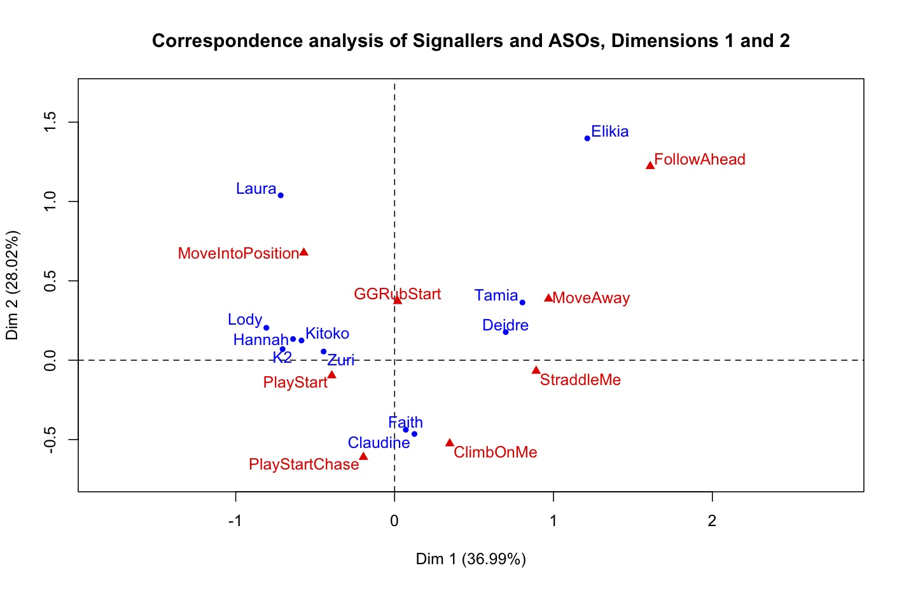
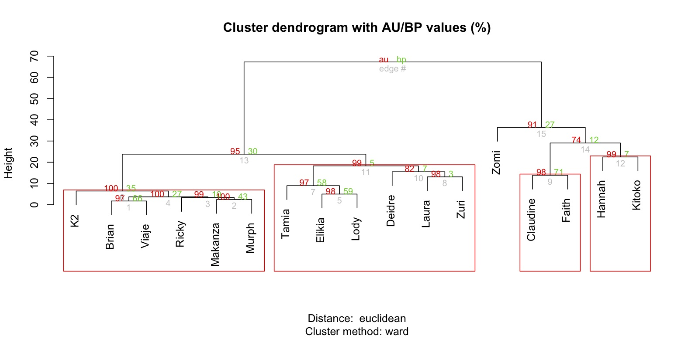

Rprojects
=========

Projects in R based on statistical analysis and visualizations for my thesis.  Here are some of the plots and visualizations 
I created in R:

Correspondence analysis between signallers and their use of different intended meanings (i.e. Actions)

Dendrogram of Actions as they differ between signallers

Social networks of bonobos and what they "say" to each other

